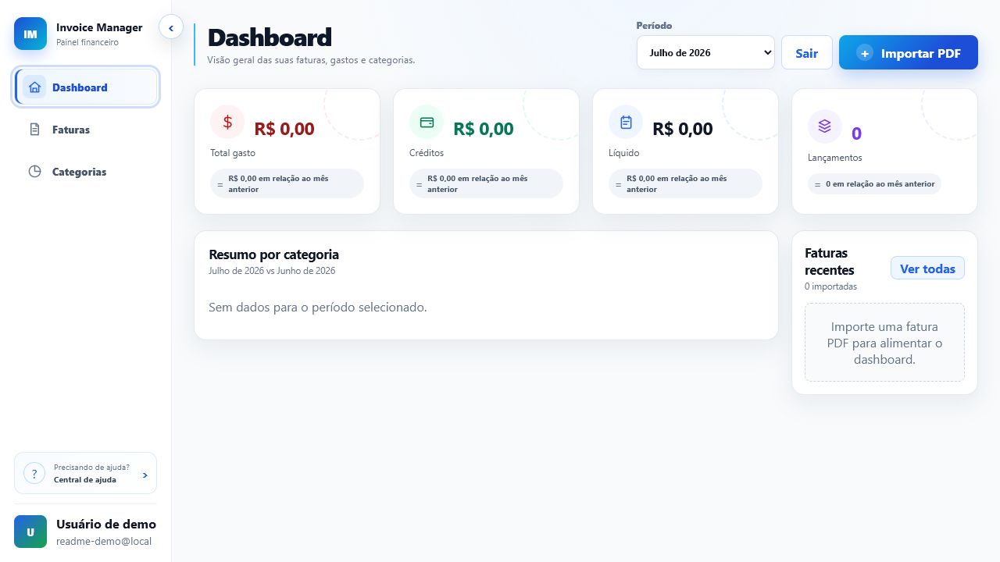
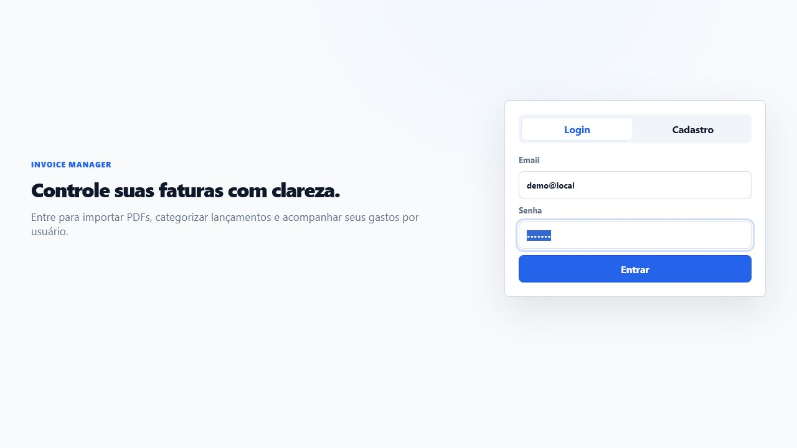
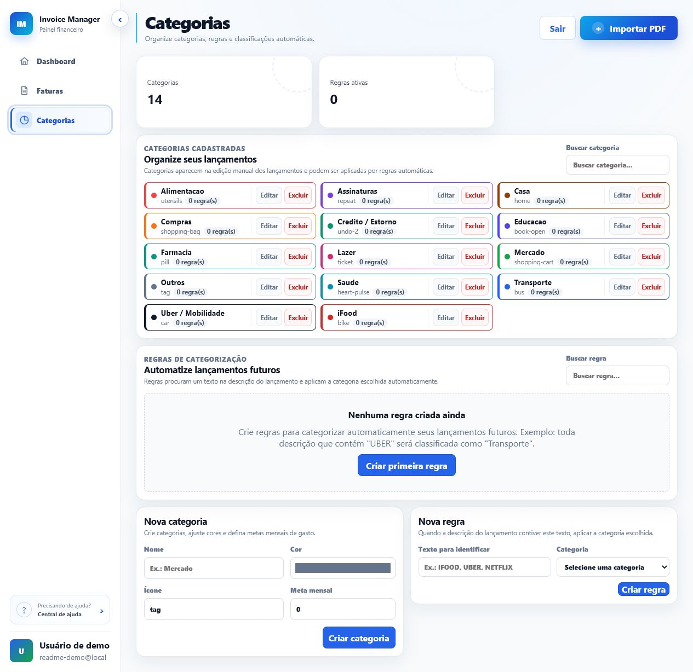
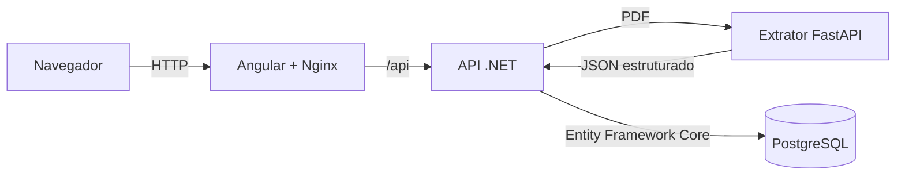
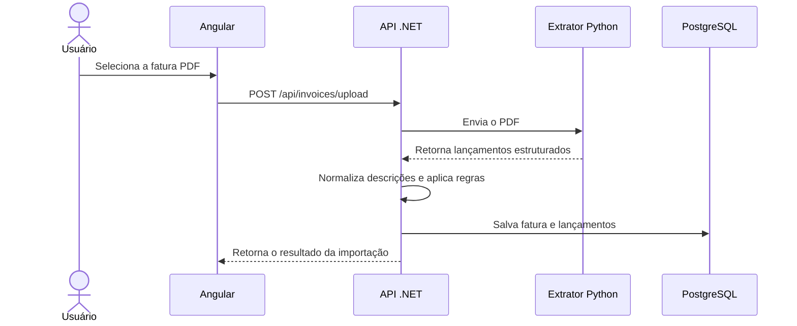

<div align="center">

# Invoice Manager

### Transforme sua fatura em uma visão clara dos seus gastos

[](https://angular.dev/)
[](https://dotnet.microsoft.com/)
[](https://fastapi.tiangolo.com/)
[](https://www.postgresql.org/)
[](https://docs.docker.com/compose/)

[**Acessar aplicação**](https://invoice.albertosena.com) · [Funcionalidades](#-funcionalidades) · [Executar localmente](#-executando-localmente) · [Arquitetura](#-arquitetura)

</div>

> [!IMPORTANT]
> Nesta versão inicial, o extrator reconhece somente faturas de cartão de crédito do **Itaú em PDF**. Outros bancos e variações de layout ainda não são suportados.

O Invoice Manager é uma aplicação web para importar faturas, extrair lançamentos automaticamente, organizar despesas por categoria e acompanhar a evolução mensal dos gastos. O projeto está hospedado em **[invoice.albertosena.com](https://invoice.albertosena.com)**.



## ✨ Funcionalidades

- Cadastro e autenticação de usuários com JWT.
- Importação de faturas do Itaú em PDF.
- Extração automática de data, descrição, valor e tipo dos lançamentos.
- Visão mensal de gastos, créditos, saldo líquido e quantidade de lançamentos.
- Comparação com o mês anterior.
- Resumo de despesas por categoria.
- Criação, edição e exclusão de categorias personalizadas.
- Metas mensais por categoria.
- Regras para categorização automática por texto da descrição.
- Reclassificação de um lançamento, de lançamentos semelhantes na mesma fatura ou de lançamentos futuros.
- Histórico de faturas importadas e consulta dos respectivos lançamentos.
- Isolamento dos dados por usuário.

<details>
<summary><strong>Ver tela de autenticação</strong></summary>



</details>

<details>
<summary><strong>Ver tela de categorias e regras</strong></summary>



</details>

## 🚀 Como usar

1. Acesse [invoice.albertosena.com](https://invoice.albertosena.com).
2. Crie uma conta ou entre com seu usuário.
3. Clique em **Importar PDF**.
4. Selecione uma fatura de cartão do Itaú em formato PDF.
5. Aguarde a extração e o processamento dos lançamentos.
6. Confira os valores importados na tela de faturas.
7. Ajuste as categorias dos lançamentos quando necessário.
8. Crie regras para que descrições recorrentes sejam categorizadas automaticamente nas próximas importações.
9. Use o dashboard para acompanhar totais, comparações mensais, categorias e metas.

> [!NOTE]
> O resultado depende do layout do PDF emitido pelo banco. Antes de usar os números para decisões financeiras, confira os lançamentos e totais extraídos.

## 🏗️ Arquitetura

O sistema é dividido em serviços independentes, conectados por HTTP e executáveis com Docker Compose.



| Componente | Tecnologia | Responsabilidade |
|---|---|---|
| Frontend | Angular 20 + Nginx | Interface, autenticação, dashboard, faturas e categorias |
| API | ASP.NET Core 9 | Regras de negócio, autenticação JWT, persistência e integração dos serviços |
| Extrator | Python 3.13 + FastAPI + PyMuPDF | Leitura do PDF do Itaú e extração dos lançamentos |
| Banco | PostgreSQL 16 | Usuários, faturas, transações, categorias, metas e regras |
| Orquestração | Docker Compose | Build, rede, volumes e execução do ambiente completo |

### Fluxo de importação



## 📁 Estrutura do repositório

```text
invoice-manager/
├── backend/             # API ASP.NET Core, entidades e migrations
├── extractor/           # API FastAPI e processamento dos PDFs
├── frontend/            # Aplicação Angular e configuração do Nginx
├── docs/images/         # Imagens usadas nesta documentação
├── .env.example         # Modelo de configuração local
├── docker-compose.yml   # Ambiente completo
└── DEPLOY_COOLIFY.md    # Notas de implantação no Coolify
```

## 💻 Executando localmente

### Opção 1 — Docker Compose (recomendada)

#### Pré-requisitos

- [Docker Desktop](https://www.docker.com/products/docker-desktop/) ou Docker Engine com Compose.
- Portas `8080`, `5000`, `8000` e `5432` disponíveis.

#### 1. Clone o projeto

```bash
git clone https://github.com/albertosena/invoice-manager.git
cd invoice-manager
```

#### 2. Crie o arquivo de ambiente

Linux/macOS:

```bash
cp .env.example .env
```

PowerShell:

```powershell
Copy-Item .env.example .env
```

Altere pelo menos estes valores no `.env`:

```env
POSTGRES_PASSWORD=uma-senha-local-forte
JWT_KEY=uma-chave-local-longa-com-pelo-menos-32-caracteres
```

#### 3. Compile e inicie os serviços

```bash
docker compose up -d --build
```

#### 4. Acesse o ambiente

| Serviço | Endereço |
|---|---|
| Aplicação | http://localhost:8080 |
| API | http://localhost:5000 |
| Health check do extrator | http://localhost:8000/health |
| PostgreSQL | localhost:5432 |

API, extrator e PostgreSQL são vinculados somente a `127.0.0.1`; apenas o frontend deve ser exposto publicamente.

#### Comandos úteis

```bash
# Acompanhar os logs
docker compose logs -f

# Conferir o estado dos containers
docker compose ps

# Parar os serviços
docker compose down

# Parar e também remover os volumes locais
docker compose down -v
```

> [!WARNING]
> O último comando apaga o banco e os PDFs armazenados nos volumes do ambiente local.

### Opção 2 — Executar cada serviço manualmente

#### Pré-requisitos

- Node.js compatível com Angular 20 e npm.
- .NET SDK 9.
- Python 3.13.
- PostgreSQL 16.

#### Banco de dados

Você pode iniciar somente o PostgreSQL pelo Compose:

```bash
docker compose up -d invoice-db
```

Configure uma connection string válida em `backend/appsettings.Development.json` ou por variável de ambiente.

#### Extrator Python

Linux/macOS:

```bash
cd extractor
python -m venv .venv
source .venv/bin/activate
pip install -r requirements.txt
uvicorn main:app --reload --port 8000
```

PowerShell:

```powershell
cd extractor
python -m venv .venv
.\.venv\Scripts\Activate.ps1
pip install -r requirements.txt
uvicorn main:app --reload --port 8000
```

#### API .NET

Em outro terminal:

```bash
cd backend
dotnet restore
dotnet build
dotnet run
```

As migrations são aplicadas automaticamente quando a API inicia. Em `Development`, a aplicação também cria os dados locais de demonstração.

#### Frontend Angular

Em outro terminal:

```bash
cd frontend
npm ci
npm start
```

Acesse **http://localhost:4200**. Nesse modo, o frontend envia as requisições para `http://localhost:5000/api`.

## ⚙️ Configuração

| Variável | Padrão local | Descrição |
|---|---:|---|
| `ASPNETCORE_ENVIRONMENT` | `Development` | Ambiente da API |
| `WEB_PORT` | `8080` | Porta pública do frontend |
| `API_PORT` | `5000` | Porta local da API |
| `EXTRACTOR_PORT` | `8000` | Porta local do extrator |
| `POSTGRES_PORT` | `5432` | Porta local do PostgreSQL |
| `POSTGRES_DB` | `invoice_manager` | Nome do banco |
| `POSTGRES_USER` | `invoice` | Usuário do banco |
| `POSTGRES_PASSWORD` | obrigatório | Senha do banco |
| `JWT_ISSUER` | `invoice-manager` | Emissor dos tokens |
| `JWT_KEY` | obrigatório | Chave de assinatura, com no mínimo 32 caracteres em produção |

Em ambientes que não sejam `Development`, a API falha ao iniciar se a chave JWT ou a connection string não estiverem configuradas explicitamente.

## 🧪 Build e testes

### Backend

```bash
cd backend
dotnet build
```

### Extrator

```bash
cd extractor
pip install -r requirements.txt pytest
python -m pytest -q
```

### Frontend

```bash
cd frontend
npm ci
npm run build
npm test
```

### Build completo com Docker

```bash
docker compose build
```

## 🧩 Como funciona a categorização

Ao alterar a categoria de um lançamento, a aplicação oferece diferentes alcances:

- **Somente este lançamento:** altera apenas o item selecionado.
- **Semelhantes nesta fatura:** aplica a categoria a descrições equivalentes da mesma fatura.
- **Lançamentos futuros:** cria uma regra por trecho de texto para categorizar novas importações automaticamente.

As descrições são normalizadas pelo backend antes da comparação. Categorias e regras pertencem ao usuário autenticado e não são compartilhadas entre contas.

## 🛠️ Adaptando para outros layouts

A extração está concentrada em `extractor/main.py`. Os principais pontos de extensão são:

- `extract_rows_from_page`: define regiões, colunas e filtros de texto.
- `parse_description_and_value`: separa descrição e valor.
- `normalize_value`: converte valores no formato brasileiro.
- `extract_transactions`: coordena a leitura das páginas e monta o resultado.

Para suportar outro banco, o ideal é criar um extrator específico por layout, identificar automaticamente o emissor e manter o mesmo contrato JSON consumido pela API .NET.

## 🔒 Segurança e dados

- Senhas são armazenadas com PBKDF2, salt aleatório e comparação em tempo constante.
- Rotas de dados exigem autenticação JWT.
- Consultas são filtradas pelo usuário autenticado.
- PDFs importados e dados do PostgreSQL ficam em volumes separados.
- Chaves e senhas reais devem existir somente no `.env` ou no gerenciador de segredos da hospedagem.
- O arquivo `.env` e os diretórios de upload não são versionados.

## 🌐 Produção

A versão pública está disponível em **[https://invoice.albertosena.com](https://invoice.albertosena.com)** e é implantada com Docker Compose no Coolify. Consulte [DEPLOY_COOLIFY.md](DEPLOY_COOLIFY.md) para detalhes do ambiente.

---

<div align="center">

Feito para transformar faturas em informação útil.

</div>
